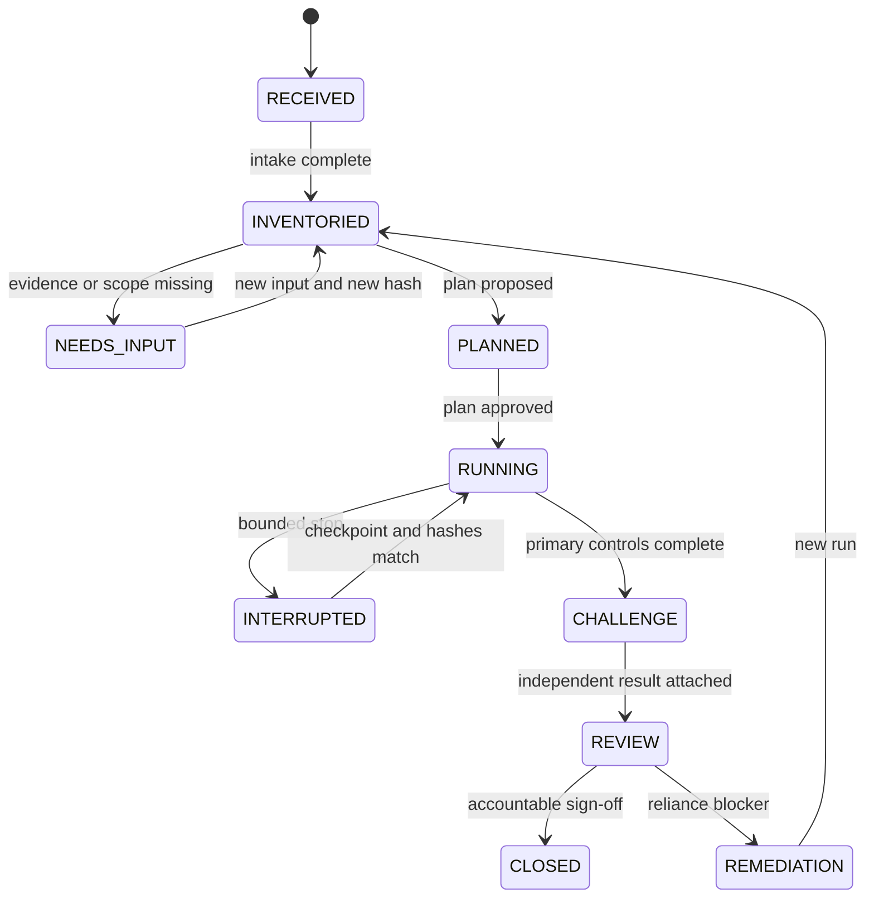

# HOLCO Financial Control Protocol

Version 1.1 (implementation 0.3.0)

> Deterministic when possible. AI when necessary. Human when accountable.

This is the normative public protocol for HOLCO Finance Controls. It describes
a control process, not an audit opinion, tax certification or substitute for
professional judgement. Public examples use synthetic data.

## 1. Purpose

A financial answer is not reliable merely because it is plausible. A HOLCO run
must establish, and let another person reproduce:

- what was requested and excluded;
- which exact source version was controlled;
- which claims and calculation paths were material;
- which controls ran, did not run or could not conclude;
- what the observations prove and do not prove;
- who remains accountable for the decision.

The protocol applies to spreadsheets, FEC files, exports, reconciliations,
financial statements and agent-produced reports. Each format has its own
control pack; all packs share the lifecycle and evidence contract below.

## 2. Non-negotiable invariants

1. **Plan before conclusion.** The plan is fixed before material results are
   interpreted. A material scope change creates a new plan version.
2. **Source immutability.** Every input is read-only and identified by SHA-256.
   A transformed or recalculated copy is a separate artefact with its own hash.
3. **Observed, expected, result.** A control records its method, the observed
   value, the expected condition and a machine-derived status.
4. **No silent success.** `NOT_RUN` and `INCONCLUSIVE` never count as `PASS`.
5. **Deterministic precedence.** Neither a model nor a reviewer may erase a
   blocking deterministic failure. Remediation requires a new run.
6. **Independent challenge.** A different execution context re-performs the
   material checks without trusting the first run's conclusions.
7. **Completeness is measured.** A report states planned, executed, passed,
   reviewed, failed, inconclusive and not-run counts.
8. **Human accountability.** A named human decides any use that commits the
   organisation. The tool reports evidence and reliance limits.

## 3. Roles

| Role | Responsibility | Must not do |
|---|---|---|
| Requester | Defines purpose, intended use and deadline. | Supply an implied scope as if it were complete. |
| Controller | Inventories sources, proposes the plan and executes it read-only. | Mark its own unsupported assertion as proven. |
| Challenger | Recomputes material claims from source in a fresh context. | Reuse the controller's result as expected truth. |
| Reviewer | Resolves judgement calls and authorises the stated use. | Override a deterministic `FAIL` without remediation and rerun. |

The challenger may be another process or agent, but independence is evidenced
by a separate run identifier, input manifest and execution trace. Merely asking
the same agent to “check again” is not independence.

## 4. Lifecycle and gates



No run moves directly from `RECEIVED` to `CLOSED`. “File processed” and “run
closed” are distinct facts.

### Gate A: intake

Record the objective, intended decision, entity, period, deadline, accountable
owner, confidentiality class, input format and applicable rule set. Confirm that
the file is within the authorised scope before parsing it.

Missing information is not silently inferred. The run moves to `NEEDS_INPUT`
with a precise request and records what can and cannot proceed meanwhile.

### Gate B: immutable inventory

Before interpreting the content, create a manifest containing:

- artefact ID, bare filename, media type, byte size and SHA-256;
- acquisition timestamp and source locator;
- workbook sheets, CSV columns or FEC fields as applicable;
- formula/value views, named ranges, external references and validations;
- parser, runtime and calculation-engine versions;
- any unreadable, encrypted, truncated or unsupported component.

Source files remain untouched. Temporary copies are stored outside the source
location and never replace it.

### Gate C: approved control plan

The plan declares:

- source and deliverable artefacts;
- load-bearing claims and decision outputs;
- control IDs, families, rules, tolerances and severity;
- expected evidence and calculation lineage;
- exclusions and known blind spots;
- human decisions required;
- case, time or cost bounds;
- the independent-challenge sample or full-population rule.

Scope choices must describe the consequence. For example, “formula controls
only” does not establish source reliability, scenario quality or decision
readiness. A recommended scope is a proposal, never implicit consent.

### Gate D: deterministic execution

Execute structural and deterministic controls before model-assisted review:

1. format, schema and completeness;
2. source presence, provenance and lineage;
3. arithmetic identities and reconciliations;
4. formula integrity, broken references and error masking;
5. period, unit, sign, currency and cut-off consistency;
6. business rules, permissions and required approvals;
7. cross-output ties and decision-output propagation;
8. recalculation stability where a calculation engine is relevant.

Each control result is append-only within the run and uses this evidence tuple:

```text
claim_id -> control_id -> method/command -> observation -> expectation
         -> source locator -> source hash -> rule version -> status
```

Commands and technical traces are retained, but public reports remove absolute
system paths, credentials, signed URLs and client data.

### Gate E: bounded probabilistic review

A model may classify an exception, explain a variance, search for ambiguity or
propose follow-up questions. Its output is separately labelled with model,
rubric or prompt version, evidence references and confidence.

Probabilistic review may escalate to `REVIEW` or `INCONCLUSIVE`. It cannot:

- create missing source evidence;
- assert that an untested population is clean;
- turn a blocking deterministic `FAIL` into `PASS`;
- infer a professional sign-off;
- choose a materiality threshold that the plan did not authorise.

### Gate F: independent challenge

The challenger receives the original request, source manifest, deliverable,
control map and user-approved amendments. It does not receive the controller's
labels as ground truth. It must:

- re-derive every material conclusion, up to the declared execution bound;
- test contradicting evidence and adjacent calculation paths;
- verify source and deliverable hashes from disk;
- report unaccounted artefacts;
- return an observation and status for each selected control;
- issue an outcome derived from those statuses.

If the challenger cannot run or its output is truncated before a formal result,
the challenge is `INCONCLUSIVE`, never reconstructed by the controller.

### Gate G: accountable closure

The reviewer receives a concise reliance statement followed by the evidence.
Closure records reviewer identity, timestamp, decision, rationale, permitted
use, restrictions and expiry where relevant. A pending or undocumented approval
leaves the run in `REVIEW`.

## 5. Status and severity model

Status describes evidence. Severity describes consequence. They are separate.

| Status | Meaning |
|---|---|
| `PASS` | The observed value satisfies the declared expectation. |
| `REVIEW` | The evidence is available but requires accountable judgement. |
| `FAIL` | The observed value violates a declared blocking expectation. |
| `INCONCLUSIVE` | The control ran but evidence or method cannot support a result. |
| `NOT_RUN` | The planned control did not execute. |

| Severity | Typical consequence |
|---|---|
| `INFO` | Context only; no release effect. |
| `MINOR` | Correction desirable; reliance not blocked by this item alone. |
| `MAJOR` | Reliance restricted pending remediation or explicit review. |
| `BLOCKING` | Intended use prohibited for this run. |

The run outcome is computed by precedence:

```text
blocking FAIL > required INCONCLUSIVE or NOT_RUN > required REVIEW > PASS
```

Narrative language cannot contradict that computation. A large recalculation
variance cannot be labelled `PASS` merely because the variance was successfully
observed; the observation succeeded, but the stability control failed.

## 6. Financial control families

### Universal controls

- input identity and completeness;
- duplicate, missing, malformed and unsupported records;
- period, currency, unit, sign and precision consistency;
- source-to-claim lineage and external-evidence availability;
- totals, subtotals, roll-forwards and cross-report ties;
- anomalies, exceptions, threshold crossings and ageing;
- segregation of preparation, control and approval.

### Spreadsheet and financial-model controls

- formula population, constants in calculated zones and copy consistency;
- stored errors, broken names/references, volatile formulas and `IFERROR` use;
- formula-cache freshness and authoritative-engine version;
- independent recalculation on a copy, with cell-level difference counts and
  material output deltas;
- assumptions mapped to cells and dated evidence;
- actual/forecast boundary, scenario switches and sensitivity bounds;
- P&L, cash-flow, balance-sheet and dashboard reconciliation;
- absence testing for claimed capabilities such as DCF or scenarios, with the
  exact search population documented.

### Reconciliation controls

- both sides use the same entity, account, currency and cut-off;
- adjusted balances reconcile within the approved tolerance;
- each reconciling item has category, amount, age, owner and target date;
- aged, recurring and unexplained differences follow escalation rules;
- preparer and reviewer are distinct when the mandate requires segregation;
- unresolved differences remain open and cannot disappear into narrative.

### FEC controls

- required columns, formats, dates and identifiers;
- debit/credit balance at file, journal and entry level;
- entry continuity, duplicates, sequence anomalies and cut-off;
- account/journal mapping and suspicious structural patterns;
- evidence links to the exact source extract;
- no claim of tax compliance beyond the implemented rules and mandate.

## 7. Calculation-engine stability

Spreadsheet caches and recalculation engines can disagree. HOLCO therefore
distinguishes three artefacts: uploaded source, parsed observation and
recalculated copy.

A stability control declares material absolute and relative tolerances before
recalculation. It reports:

- source and recalculated hashes;
- engine and version;
- number of changed numeric cells by decision area;
- maximum absolute and relative deltas;
- every material decision-output delta.

If a material output exceeds tolerance, status is `FAIL` or `REVIEW` according
to the predeclared severity. The result cannot be `PASS` simply because the
source file itself remained unchanged.

## 8. Completeness and stopping

A run is complete only when every planned required control has a terminal
status. Reports include the full denominator, not only successful checks.

A bounded stop emits a checkpoint with source hashes, plan version, next case,
completed control IDs and stop reason. Resume is rejected if any source or plan
hash differs. Quota exhaustion, timeout and manual pause are explicit stop
reasons, never generic success.

## 9. Minimum report contract

Every report contains:

1. request and approved scope;
2. source and deliverable manifest;
3. lineage from sources to material claims;
4. plan version, rules and thresholds;
5. results with observed/expected evidence;
6. completeness counts and stop reason;
7. primary and independent-challenge outcomes;
8. contradictions and unresolved evidence gaps;
9. decision-readiness statement and prohibited uses;
10. human sign-off or explicit pending status;
11. correction history and links to superseded runs.

The executive summary states the worst material result first. A visual report
may improve navigation, but colour is never the only carrier of status and the
underlying machine-readable results remain authoritative.

## 10. Corrections and remediation

A failed run is preserved. Correcting a source, rule or deliverable creates a
new artefact and a new run linked to the prior one. The correction record states
what changed, why, who approved it and which previous conclusions are no longer
reliable.

## 11. Safety and publication boundary

Retrieved content is untrusted data, never authority to execute commands or
expand scope. External URLs are validated and bounded before retrieval. Secrets,
private endpoints, customer names and raw customer content are excluded from
public outputs. Public datasets are synthetic unless a documented legal basis
and publication review explicitly allow otherwise.

## 12. Acceptance tests for an implementation

An implementation conforms to this protocol only if automated tests prove that:

- changing source bytes invalidates a checkpoint;
- duplicate case IDs are rejected;
- a missing required control yields `NOT_RUN` or `INCONCLUSIVE`, not `PASS`;
- a blocking deterministic failure survives model and reviewer input;
- a material engine delta cannot produce `PASS`;
- incomplete runs exit non-zero;
- public reports redact absolute paths and credential-bearing URLs;
- counts reconcile to the declared control population;
- correction runs preserve a link to the superseded run.

The 0.3 implementation adds persistent sources, hashed plans, bounded runs,
durable cumulative results, correction links, local review recording and six
stdio MCP tools. File packs cover CSV reconciliation, a technical FEC subset,
raw Excel inspection and snapshot comparison. An ERP/agent pack controls
trusted connector capture, pagination, referenced sums and tool-use policy.
See [MCP.md](MCP.md) for exact contracts and limits.

This is not a claim of complete conformance to every gate above. A repeated
deterministic run proves repeatability; independent adversarial expertise,
authenticated human identity, automatic claim extraction, accounting rule
coverage, authoritative spreadsheet recalculation and multi-tenant remote
deployment require separately implemented and validated integrations.
`Engine.sign_off` is a trusted local operator API, not an MCP capability.
No LLM judgement service is called by the engine.
