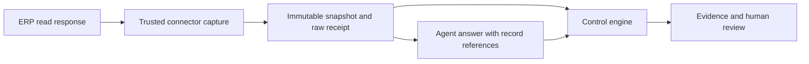

# Calling HOLCO Finance Controls through MCP

The 0.4 engine exposes six tools over local stdio using the official
[MCP Python SDK](https://github.com/modelcontextprotocol/python-sdk).
The entry point is `holco-controls-mcp`. It is runnable locally; no production
HOLCO gateway or console route is installed by this repository.

## Installation

```bash
python3 -m venv .venv
.venv/bin/pip install -e '.[mcp]'
```

Configure the MCP host with the absolute executable and a private database
path on the machine where the process runs:

```json
{
  "mcpServers": {
    "holco-controls": {
      "command": "/absolute/path/to/.venv/bin/holco-controls-mcp",
      "env": {"HOLCO_CONTROLS_DB": "/absolute/private/path/controls.db"}
    }
  }
}
```

The server is single-operator. Every tool invocation in the same process can
access that process's stored sources and runs. Use a dedicated private database
per operator or mandate. SQLite stores source contents without application-level
encryption; the operating environment must provide the required confidentiality.
Do not expose this stdio service as a shared HTTP endpoint without authentication,
tenant isolation, quotas, deadlines and the existing gateway's access policy.

## Tools and sequence

| Tool | Input | Result |
|---|---|---|
| `list_control_protocols` | None | Supported packs and input limits |
| `register_control_source` | Content, `utf8` or `base64` | Opaque source ID and SHA-256 |
| `prepare_control_plan` | Source IDs, pack, tolerance, optional policy | Versioned scope, exclusions and plan hash |
| `start_control_run` | Plan ID and approved hash | Persistent run ID |
| `advance_control_run` | Run ID, up to 8 controls | Persisted results and next checkpoint |
| `get_control_report` | Run ID | Results, coverage, hashes and pending review |

Repeat `advance_control_run` until `complete=true`. A restarted server resumes
the same run from SQLite without dropping earlier results. Execution is bounded
by controls per call and input/archive size; this is not a hard wall-clock
deadline or a provider-token budget. A failed control is distinct from an MCP
transport failure. Always inspect `outcome`, `deterministic_outcome` and counts.

Plan hashes bind execution scope; they do not authenticate human consent.
Technical success remains globally `REVIEW` until a trusted local operator
records review. `Engine.sign_off` is intentionally unavailable over MCP. It
requires a separate completed repeatability run and an operator's rationale;
that replay alone does not constitute an independent expert assessment.

## ERP response and agent verification



Select `erp_agent_response` with two registered source IDs: the ERP snapshot
first, the structured agent answer second. Use `examples/erp_snapshot.json` and
`examples/agent_claims.json` to exercise the contract with synthetic data.
The policy declares the actual permitted tool names, for example:

```json
{
  "allowed_tools": ["list_invoices"], "required_tools": ["list_invoices"],
  "required_period": "2026-09", "required_currency": "EUR",
  "required_scope": "all_period_records"
}
```

Amounts are decimal strings. Each claim declares `record_ids`, `currency`,
`period`, `amount`, and `scope` (`selected_records` or `all_period_records`).
Currently the supported computation is a sum. For a period total, omitting any
matching record fails the control. Ratios, VAT rules, payment matching and prose
claim extraction need explicit additional rules; they are not inferred.
Bind the requested period, currency and scope in the approved plan as above.
A correct total for the wrong period fails `request_scope`. Missing request
criteria are inconclusive. Use separate plans for different requested periods
or currencies in this initial adapter contract.

The checker derives expected amounts from the snapshot, verifies references,
currency/period, extraction count and pagination, then inspects the connector
trace against the plan's tool policy. A trace supplied in the agent answer is
ignored. Missing extraction coverage prevents a global technical pass.

For a live connector such as Pennylane, the application adapter calls
`Engine.capture_erp_response(raw_response, records, coverage, tool_calls)`
immediately after the authorised read response. That trusted Python API retains
the raw bytes and issues a receipt linked to the normalized snapshot. It is not
an MCP tool. The adapter must map real response fields, exact request filters,
pages and tool results; it must never assert completeness from a partial page.
For multiple pages, store the complete raw response envelope and derive the
coverage metadata from the actual pagination sequence.

Snapshots imported through the general MCP upload tool are classified as
unattested inputs. Their source-provenance control stays `INCONCLUSIVE`, even if
their JSON claims to come from an ERP. This is deliberate: the agent cannot
authenticate its own evidence by adding a field.

The receipt proves capture by trusted adapter code, not accuracy of that
adapter's normalization. Verify connector mappings against provider-specific
fixtures before production. This release makes no live Pennylane API call and
does not add tools to HOLCO's deployed MCP.

## File packs

- `excel_snapshot`: client-observed JSON, not a reconstructed XLSX. Contract below.
- `excel_reconciliation`: two observed snapshots with explicit cross-sheet mappings;
  compare amounts without rounding. Mapping suitability and provenance stay REVIEW.

- `reconciliation_csv`: UTF-8 CSV, columns `id,expected,observed`, decimal amounts.
- `fec_tsv`: technical subset using `JournalCode,EcritureNum,EcritureDate,Debit,Credit`;
  dates, decimal amounts, entry balance and duplicates. Not the full statutory FEC specification.
- `workbook_xlsx`: raw OOXML inventory, stored errors, broken references/names,
  and missing formula caches. Does not execute formulas, macros or external links.
- `workbook_comparison`: compare two independently prepared XLSX snapshots.
  Differences above the absolute tolerance fail; missing or uncomparable cells
  prevent a pass. This includes identical missing formula caches, error cells and
  unsupported text/shared-string cells. This conservative whole-workbook pack does
  not resolve text values; use explicit observed-worksheet mappings for a targeted
  financial comparison. Same file contents do not establish engine independence.

XLSX is base64-encoded for MCP transport. Large files should be registered by
the trusted local adapter, avoiding a multi-megabyte round trip through an LLM.
Tolerance is expressed in the stored cell units: EUR and kEUR must be handled
in separate plans when their tolerances differ. The engine never silently runs
LibreOffice on production files. Recalculation must happen on a sandboxed copy
with a separately recorded engine version.

## Publishing and report handling

### Excel client snapshots

When a spreadsheet client cannot export XLSX bytes, register this JSON as UTF-8:

```json
{
  "workbook": "synthetic.xlsx", "sheet": "Cash", "scope": "A1:C1",
  "captured_at": "2026-01-01T00:00:00Z",
  "cells": [
    {"address": "A1", "value": 100, "formula": null, "error": null},
    {"address": "B1", "value": 20, "formula": null, "error": null},
    {"address": "C1", "value": 120, "formula": "=A1+B1", "error": null}
  ],
  "checks": [{"id": "rollforward", "target": "C1", "terms": [
    {"address": "A1", "coefficient": "1"}, {"address": "B1", "coefficient": "1"}
  ]}]
}
```

Only copy actual tool observations. Missing formula/error views must be omitted,
not invented as null. Null means observed absence; a typed error is distinct from
a literal string such as `#REF!`. One sheet per snapshot, up to 10,000 unique
cells and 500 proposed linear equations. Values used in equations must be JSON
numbers; coefficient strings express signs and weights. Missing operands are
INCONCLUSIVE. No formula, macro, external link or code is executed.

Ask for missing objective, period, scope and tolerance before planning. Supply
policy `objective`, `required_period`, `required_scope`; show the returned plan,
including its source-bound equations and exclusions, before requesting approval.
Equations are proposals whose suitability needs human review, not trusted agent
answers. The engine recomputes their expected amounts from observed source cells.
Broken references and typed errors fail; constants alone do not fail. Scope is
always REVIEW because only submitted cells are covered, provenance is unattested,
and full-workbook coverage, recalculation and dependencies remain excluded.

Snapshot reports may include sheet names, cell addresses and amounts in equation
evidence. They remain private financial data and must not be published by default.

### Cross-sheet reconciliation

Register two snapshots using the same observation contract. In the **first**
snapshot, add `comparisons: [{"id":"monthly_total","left":"G5","right":"B5"}]`.
The addresses point to the first and second sources respectively; supply their
source IDs in that order when planning `excel_reconciliation`. The plan includes
the source-bound mappings and both scopes. At most 500 mappings are supported.
Do not assume row positions match: confirm labels, entity, period, currency and
stored units before proposing the plan. Supply objective, period, scope and the
approved absolute tolerance. Never compare a cell against itself as evidence.

The engine executes `comparison_scope` (REVIEW) and `mapped_amounts`: numeric
observations are compared using decimal arithmetic. A difference above tolerance
fails; absent mappings, missing cells, missing error-type observations and
nonnumeric/error values are INCONCLUSIVE. Zero difference does not attest the
ERP source or the completeness of accounting postings. Equations within each
sheet remain a separate `excel_snapshot` plan. No formula is executed.

Report one short business summary by default. Keep cell-level observations,
hashes and call traces in the detailed report, not in every conversation step.
Rules loaded without execution must not inflate the executed-control count.

Reports omit raw rows, workbook names, cell values and source URLs by default;
they return counts, deltas and opaque evidence references. They can still be
sensitive financial information and are not automatically safe to publish.
No public publication tool, ERP write tool or human-approval tool is exposed.

Corrections create a new source and a plan with `supersedes` set to the previous
run ID. Old results remain retrievable. No source/run deletion API is provided;
the operator owns retention and backup of its private database.

## Runner compatibility

Version 0.4 plans bind an implementation source manifest in addition to source and
plan hashes. Use a new database and new plans when upgrading from 0.3; keep the
old compatible environment for historical inspection. See [CHANGELOG](CHANGELOG.md).
