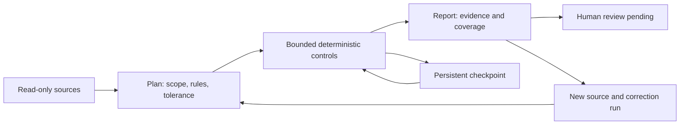

# HOLCO Finance Controls

[](https://github.com/holco-apps/holco-finance-controls/actions/workflows/tests.yml)

**Check a financial agent's output against explicit data and rules. Keep the evidence when it fails.**

HOLCO Finance Controls is an experimental, local control engine with persistent
runs and an MCP interface. It separates the agent producing a result from the
checks that test it and the human deciding whether to use it.

> Deterministic when possible. AI when necessary. Human when accountable.

**Version 0.4.0 · Alpha · Python 3.11+ · MIT.** The examples are synthetic.
The public engine is usable on its own; private gateways, credentials, customer
data, connectors and product hosting are not needed to try it.

## Try the complete workflow in two minutes

No API key, LLM, ERP connection or Docker required. From a terminal:

```sh
git clone https://github.com/holco-apps/holco-finance-controls.git
cd holco-finance-controls
python3 -m venv .venv
. .venv/bin/activate
python -m pip install -e .
holco-controls-demo --output demo-evidence
```

On Windows, use `py -m venv .venv`, then `.venv\Scripts\Activate.ps1` in PowerShell.
Choose a **new output directory** on each run; the demo refuses to overwrite evidence.
Or omit `--output` to use a fresh temporary directory.

The command really runs the engine, closes and reopens its database, and checks:

| Step | What happens | Expected result |
|---|---|---|
| Plan | Register a synthetic €12,400 source with an incorrect €12,900 observation; bind scope and tolerance | Hashed plan |
| Interrupt | Execute only the population check | `INCONCLUSIVE`, one `NOT_RUN` |
| Resume | Reopen the database and finish the same run | `FAIL`, €500 discrepancy; earlier result preserved |
| Correct | Register €12,400 as a new observation; link a new plan to the failed run | Technical `PASS`; old failure retained |
| Review | Read the corrected report | Global `REVIEW`; **no human approval invented** |

Exit code **0** means these expected behaviours were verified, including the
intentional failure. An unexpected behaviour raises an error and exits nonzero.
This differs from the Golden Set CLI, which exits 1 if its dataset contains a FAIL.

Open `demo-evidence/summary.json`, `report-failed.json` and
`report-corrected.json`. You get real source hashes, plan hashes, implementation
identity, observations, expected conditions, counts and correction lineage.
The example uses declared expected values in a CSV; it does not independently
capture ERP data or establish a professional opinion.

[Annotated walkthrough and report guide →](WALKTHROUGH.md)

## The workflow is the interface



A plan fixes what will be tested before execution. A missing control is counted,
not silently omitted. A correction creates a successor; it does not edit a failed
report. A technically successful run still needs a separately recorded decision.

**A hash establishes identity and integrity, not human consent or source truth.**
An approved hash supplied by an agent does not authenticate approval. The host
must obtain consent, select an appropriate scope and establish source provenance.
[Architecture, trust boundaries and state transitions →](ARCHITECTURE.md)

## What you can use today

| Capability | Public implementation | Boundary |
|---|---|---|
| Persistent orchestration | SQLite sources, plans, bounded runs, restart, correction lineage | Local single operator; no remote scheduler or tenant isolation |
| Deterministic controls | 10 packs: CSV, technical FEC subset, XLSX, observed worksheets, explicit reconciliation, structured reviews and ERP claims | Exact contracts and exclusions; not a general accounting audit |
| Evidence | Source/plan hashes, implementation manifest, observed/expected results, coverage counts | Hashes do not prove normalization accuracy or truth of a source |
| MCP | Six local stdio tools; real transport and restart test | Authentication and authorization belong to the host |
| Human review | Separate trusted local `Engine.sign_off` API; absent from MCP | Operator identity is not authenticated by this package |
| Independent challenge / semantic review | Protocol describes the intended roles | No autonomous challenger, calibrated LLM judge or expert validation service |

[Pack inputs and examples](REFERENCE.md) · [MCP contracts](MCP.md) ·
[Normative protocol and conformance limits](CONTROL_PROTOCOL.md)

## Python engine, language-independent integration

Python implements the reference checks. A Java, JavaScript/TypeScript or other
application can use the **MCP stdio interface** and JSON reports; it does not need
to reimplement the rules. The package makes no model-provider calls.

```sh
# Optional MCP transport; the deterministic core itself has no runtime dependencies.
python -m pip install -e '.[mcp]'

# Optional Node.js smoke client, using only Node's standard library:
node examples/node-client.mjs demo-node
```

The Node example executes the same demo command, reads its JSON contract and
checks the expected statuses. It is a subprocess integration example, **not an
MCP client**. [Java/JVM, TypeScript and host integration options →](INTEGRATION.md)

## Verify and challenge it

```sh
python -m pip install -e '.[mcp]'
python -m unittest discover -s tests -v
```

CI runs the tests and packaged demo on Python 3.11 and 3.12. Tests cover restart,
source tampering, wrong plan/build identity, retained failures, decimal precision,
missing Excel caches, tool policy, ERP capture receipts and the stdio lifecycle.
Without the optional MCP dependency, its transport test is explicitly skipped.

The three-case [Golden Set](examples/golden_set.json) is a readable example, not
a financial-accuracy benchmark. Unit-test counts and `mean_metric_score` are not
professional validation, false-positive rates or reliability percentages.
Independent domain calibration is still required.

We welcome reproducible counterexamples: input, expected result, actual result,
rule and scope. Use synthetic data and explain whether the expectation comes
from a calculation, a declared rule or an independently reviewed source.
[Contribute](CONTRIBUTING.md) · [Report a vulnerability privately](SECURITY.md)

## Upgrading

0.4.0 fixes decimal verdicts and conservative XLSX comparison coverage, and binds
new plans to the implementation source manifest. It also brings the previously
separate advanced packs into the main release. **0.3 databases are not migrated:**
retain their compatible engine for historical inspection; use a new database and
new plans with 0.4.0. [Release notes and compatibility](CHANGELOG.md).
