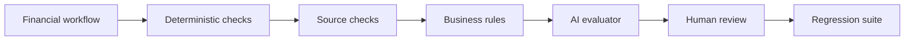

# HOLCO Finance Evals

A small, reproducible benchmark for testing whether financial AI agents follow
the numbers, sources and business rules — not just whether they sound right.

> Deterministic when possible. AI when necessary. Human when accountable.

This public repository is a deliberately isolated technical exhibit. It uses
only synthetic data and contains no HOLCO production code, credentials, client
names or internal endpoints.

## Evaluation flow



The included reference implementation covers the deterministic core. An AI
evaluator may add context, but it cannot silently override a failed control.

## What is evaluated

Each synthetic case contains source facts, an agent answer and explicit
tolerances. The runner evaluates:

- numerical agreement with the source facts;
- source identifiers and evidence coverage;
- business-rule compliance;
- escalation when the decision is materially ambiguous.

The aggregate outcome has three states:

- `PASS`: all blocking controls pass;
- `REVIEW`: no blocking failure, but human judgement is required;
- `FAIL`: at least one blocking control failed.

## Run locally

Python 3.11+ is sufficient; the package has no runtime dependency.

```bash
python -m holco_finance_evals examples/golden_set.json
python -m unittest discover -s tests -v
```

From a fresh clone, either install the package or expose `src`:

```bash
python -m pip install -e .
holco-finance-evals examples/golden_set.json
```

The command emits JSON Lines so results can be archived and compared in CI.
It exits with code `1` when any case fails.

## Golden Set

[`examples/golden_set.json`](examples/golden_set.json) is intentionally small
and readable. It demonstrates:

1. a fully grounded cash-position answer (`PASS`);
2. an answer that is numerically correct but needs accountable approval
   (`REVIEW`);
3. a plausible answer that contradicts the ledger (`FAIL`).

Real benchmarks should be versioned, reviewed by domain owners and extended
with every material production incident. They should never be built from
customer data without a documented legal basis and publication review.

## Design boundaries

- Evaluation is separate from generation.
- Deterministic controls run before probabilistic judgement.
- Evidence is identified by stable source IDs, not prose alone.
- A reviewer is required for decisions marked accountable.
- No network call, telemetry or model provider is embedded in this example.

See [SECURITY.md](SECURITY.md) for responsible disclosure and
[CONTRIBUTING.md](CONTRIBUTING.md) for the publication rules.

## Licence

MIT. Copyright © 2026 HOLCO INVEST.
